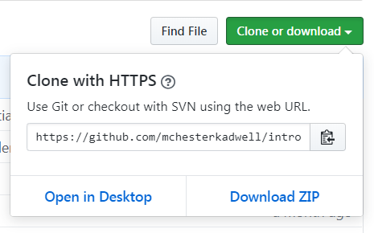
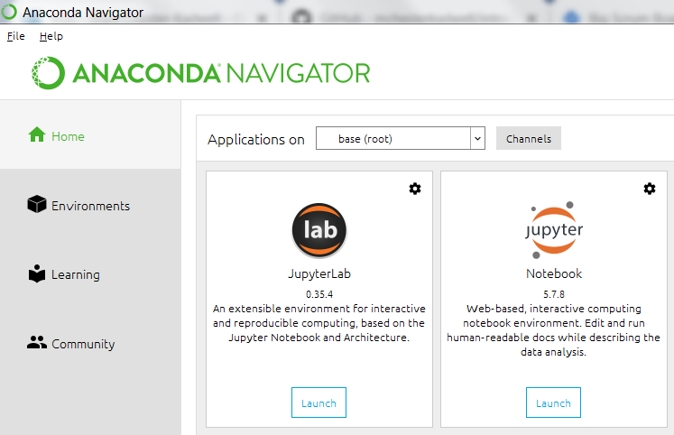
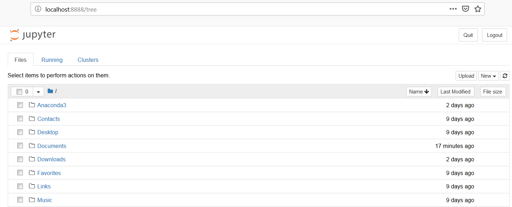
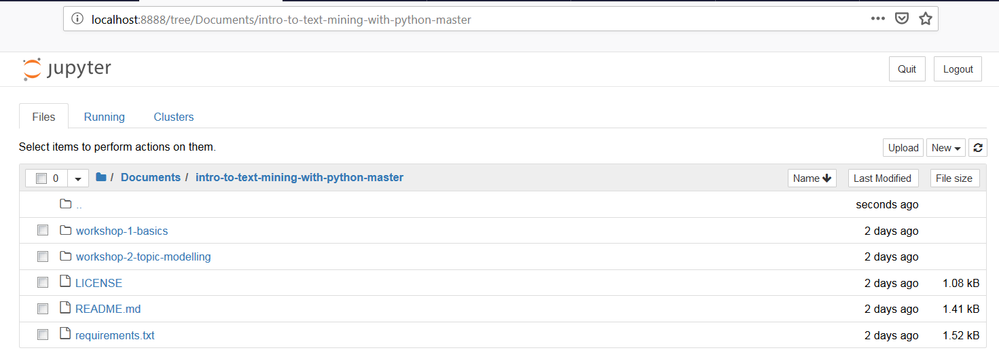

# Coding for Humanities course materials

The following instructions are based on
https://github.com/mchesterkadwell/intro-to-text-mining-with-python

## Running Notebooks on Your Own Computer

These instructions are suitable if you have never installed Jupyter Notebooks 
or Python on your own computer before.

### Install Jupyter Notebooks and Python with Anaconda 

[Install Anaconda (Python 3.7)](https://www.anaconda.com/distribution/#download-section). 

Pick the version appropriate for your operating system (Windows, Mac, Linux). 
Make sure you choose ‘Python 3.7’ (not ‘Python 2.7’). 

Once it has installed, [open Anaconda Navigator](http://docs.anaconda.com/anaconda/user-guide/getting-started/#open-navigator).

### Download the Notebooks from GitHub 

Go to the [GitHub page](https://github.com/andreasvc/codingforhumanities) 
where this code repository is kept. For a simple download, click the 'Clone or 
download' green button, then pick 'Download ZIP'.

Open the ZIP file that is downloaded. In most operating systems this will 
automatically unzip it back into individual files. Move the folder to 
somewhere you want to keep it, such as 'My Documents'. 

(The more advanced method is to use git to clone the repository, but we won't 
cover that here.)

### Quick Start: Run a Notebook Quickly in the Default (root) Environment 

In simple terms, an environment is like an isolated box in which to run a 
notebook safe from interference by other notebooks. Anaconda provides one 
default environment, called ‘root’, in which to get up and running quickly. 

In **Anaconda Navigator > Home** there is a card for Jupyter Notebook (not 
JupyterLab). Click on the 'Launch' button. 

This opens a web page at **http://localhost:8888/tree** that shows your whole file 
system.  

Navigate to where you downloaded the notebooks, and click on one to run it in 
the usual way. 

